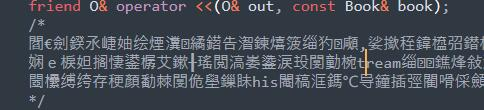

# 整体设计分析(总结)

## 系统结构

### 菜单

```cpp
void Menuout(bool Signed){
	cout << "----MENU----\n";
	cout << "<<User>>" << endl;//用户
	cout << "Search\n";//搜索图书
	cout << "GetUserLog\n";//查看日志
	cout << "ChangeKey\n";//修改密码
	if(Signed){
		cout << "<<Manager>>" << endl;//管理员
		cout << "addAccount\n";//添加账户
		cout << "deleteAccount\n";//删除账户
		cout << "changeBook\n";//修改图书
		cout << "addBook\n";//添加图书
		cout << "deleteBook\n";//
	}
}
```

### 结构设计

本来是想给每一个结构开一个读入池的，但是后来发现实现起来不那么直观，于是只好放弃了最开始的`读入池-功能区` 结构，选择了比较容易实现的纯函数结构。

整个系统包含3个大类，一个主要数据库类 `Database` ，两个子类 `Book` 和 `User` 。管理员则是在 `User` 类中使用了标记来标记管理员权限。

## 过程

### #1  12.19

小组一起讨论了整个程序的大体框架，划分了功能模块。并且详细讨论了各个功能应该怎那样实现。

进行了一次知识点的扫盲，发现了待学习的知识点（文件和流），并且补充了相关知识。总体来说没有甚么大问题，就是一个较大的模拟。

#### 小结

准备工作都搞好了，开写！

### #2  12.20

针对专用类重载了IO流，发现专用类的流运算符以成员和友元函数形式重载的有一点点区别（成员重载的流运算符使用方法真的阴间( ﾟ∀。)），然后成功的用模板同时重载了多个流（ᕕ( ᐛ )ᕗ）。

* 关于重载自定义类的流运算符的注意事项：

  我们都知道流运算符是双目运算符，但是如果要用成员函数形式重载，它就只能有一个参数：

  ```cpp
  istream& operator >>(istream& in);
  ```

  另一个参数由this指针传入，但是这样的话，语法就会变成 `Class >> cin` 了。
  不符合习惯。而且也无法链式使用了：`cin>>a>>b;`

  所以流运算符最好还是重载为友元，保持统一的语法习惯和使用方法很重要。


重新梳理了下细节，确定了以人造缓冲区为输入检索池的用户操作界面；确定了状态标识符标识的功能区状态；全局功能—局部功能为功能池的架构。

#### 小结

其实都是我一个人yy的（`ヮ´ ），还是要和队友交流一下工作的。包括如何统一两个人的想法和进度等等。

已经把进度放到Github Pages了，队友可以随吃查看的（*ﾟ∇ﾟ）

PS. 用的是docsify，本来打算用来搞Blog，但是由于懒|-` ），到现在还是没打理，就只有一个简陋的页面，但是用来干这个足够了。

### #3 12.21

今天咕咕咕了。

### #4 12.22

出师不利，开局就碰到了大问题。为了在控制台正确地输出中文，与sublime的文件编码搏斗了近半个小时，心态有点小炸。windows下控制台窗口的默认编码为 `GBK` ，这波和默认 `utf-8` 的 sublime 配合得并不是很好（都用utf-8不就行了吗）。


尝试修改控制台默认编码，发现并不能行。那看来只有修改sublime的默认编码了。从网上查找了一众资料后，终于成功地给sublime加上了 `GBK` （装上了插件）。但是后来！发现安装的插件竟然有冲突Σ(っ °Д °;)っ！在我的一通瞎操作下我的中文注释变成这个样子：



一通乱搞之后，终于把sublime调教好了，之前一直给我默认保存 `utf-8` 然后又在dump模式下重编码，还好这波及时止损，只损失了一个文件里面的注释，现在已经能够成功地在控制台输出中文了。（浪费了好多时间...）

那么接下来的时间我们就要继续了（指修注释）。

真后悔没有把文件加入版本控制。呜呜呜~。

### #5 12.23

又是咕咕咕的一天，再这么咕下去人要没了。

### #6 12.27

~~人没了~~

### #7 12.28

看了下以前写的查找模块，感觉结构还是不好，又推翻了重写，感觉以后要给每个功能模块单独开个读入池了。

### #8 12.31

吐血，为了方便访问在类内内置了顺序的引用，但是发现c++并不支持引用数组，原因是一个引用类型必须在声明时就初始化，但数组类型无法正确初始化（尝试使用初始化列表也不行）。只好用指针代替。随后又遇到了友源不能访问private的问题，发现是因为声明友元函数没有传入相同的参数，导致编译器认为这是一个函数的重载。

然后由于写得太丑再次重写，这次打算用纯指针写法，不用重载=方便比较。。。

吐了。

### #9 12.7

最后一天，在课堂上完成了主要类，细分类在之前的时间里也磕磕绊绊地完成了，进度有点赶，但是没关系，重要的是学习如何去写，如何去思考，如何去组织架构。

整个实验总体来说还算满意，没能写成工整的模块化有点遗憾，但是学到了很多，积累了经验，这就足够了。


## 心得

### 解决问题方面

1. 对项目分析要先从整体入手，先分析出框架，再具体各个突破；
2. 考虑问题要细致；

### 学到知识

1. string的相关函数用法；
2. 文件读写；
3. 重载输入输出；
4. 一点模板的使用；
5. new的一些使用。
